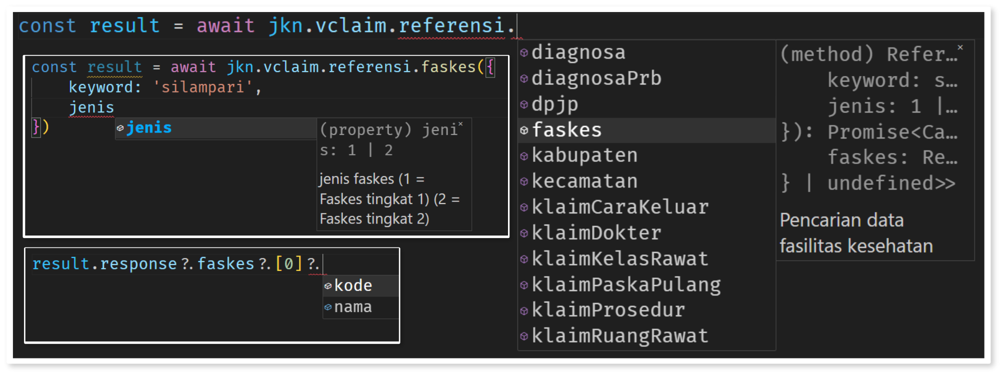

# JKN SDK

JKN (BPJS) Bridging API untuk NodeJS

## Instalasi

Instalasi paket dapat dilakukan dengan perintah berikut:

```bash
npm install @ssec-llg/jkn
```

Instalasi juga dapat dilakukan menggunakan `PNPM` atau `YARN`

## Penggunaan

Penggunaan paket ini sangatlah sederhana, cukup menginisialisasi global instansi pada sebuah modul atau file seperti berikut:

```ts
// file: jkn.ts atau jkn.js

import JKN from '@ssec-llg/jkn';

const jkn = new JKN({
	/* config */
});

export default jkn;
```

Secara default konfigurasi seperti cons id atau secret akan dibaca melalui environment variable namun konfigurasi juga dapat diatur pada constructor class JKN seperti berikut:

```ts
// file: jkn.ts atau jkn.js

import JKN from '@ssec-llg/jkn';

const jkn = new JKN({
	consId: '<cons id dari bpjs>'
	// dan seterusnya ...
});

export default jkn;
```

Selain menggunakan objek, konfigurasi juga dapat diatur menggunakan fungsi, misalnya pada kasus membaca atau mendapatkan konfigurasi dari database:

```ts
// file: jkn.ts atau jkn.js

import JKN from '@ssec-llg/jkn';

const jkn = new JKN(async () => {
	const result = await sql`select * from config`;
	return {
		consId: result.consId
		// dan seterusnya ...
	};
});

export default jkn;
```

> ⚠ Perlu diperhatikan bahwa fungsi pada constructor parameter tersebut hanya akan dipanggil satu kali. Bila terjadi perubahan konfigurasi harap memanggil fungsi `invalidateConfig(): Promise<void>` pada instansi JKN untuk memperbaharui atau menerapkan perubahan konfigurasi.

Kemudian cukup impor module `jkn` tersebut di mana pun saat akan menggunakannya:

```ts
import jkn from './path/to/jkn.js';

const result = await jkn.vclaim.referensi.faskes({
	keyword: 'silampari',
	jenis: 2
});

console.log(result);
/*
{
	response: {
		faskes: [
			{
				kode: "0089S002",
				nama: "Klinik Utama Mata Silampari Sriwijaya Eye Centre"
			}
		]
	};
	metaData: {
		code: "200";
		message: "OK";
	};
}
*/
```

Setiap parameter dan response objek memiliki type TypeScript dan komentar dokumentasi yang dibentuk sesuai dengan dokumentasi API BPJS Kesehatan pada [TrustMark](https://dvlp.bpjs-kesehatan.go.id:8888/trust-mark/main.html) dengan demikian developer dapat membaca langsung dokumentasi cepat dari kode tanpa harus bolak-balik halaman TrustMark yang tentunya akan sangat mempersingkat proses development.



## Konfigurasi

Konfigurasi mengikuti interface berikut:

```ts
interface Config {
	/**
	 * Cons ID dari BPJS
	 *
	 * @default process.env.JKN_CONS_ID
	 */
	consId: string;

	/**
	 * Secret key dari BPJS
	 *
	 * @default process.env.JKN_CONS_SECRET
	 */
	consSecret: string;

	/**
	 * User key VClaim dari BPJS
	 *
	 * @default process.env.JKN_VCLAIM_USER_KEY
	 */
	vclaimUserKey: string;

	/**
	 * User key Antrean dari BPJS
	 *
	 * @default process.env.JKN_ANTREAN_USER_KEY
	 */
	antreanUserKey: string;

	/**
	 * Berupa mode "development" dan "production". Secara default akan
	 * membaca nilai environment variable NODE_ENV atau "development"
	 * jika NODE_ENV tidak terdapat nilai. Mode ini berpengaruh pada
	 * nilai konfigurasi yang digunakan dan JKN API base url.
	 *
	 * @default process.env.NODE_ENV || "development"
	 */
	mode: 'development' | 'production';

	/**
	 * Secara default bernilai `false` sehingga setiap terjadi kesalahan
	 * saat mengirim permintaan ke server JKN menggunakan method `send()`,
	 * pesan kesalahan akan dikembalikan sebagai pesan response dan log
	 * error akan dicetak pada konsol atau terminal. Jika bernilai true,
	 * maka kesalahan akan di-throw.
	 *
	 * @default false
	 */
	throw: boolean;
}
```

## API tersedia

- [x] VClaim
- [x] Antrean
- [ ] Apotek
- [ ] PCare

> API yang belum tersedia akan dikembangkan. Jika ingin berkontribusi silakan buat PR.

## Lisensi

[MIT](./LICENSE)
